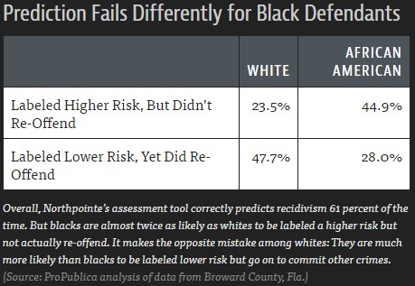
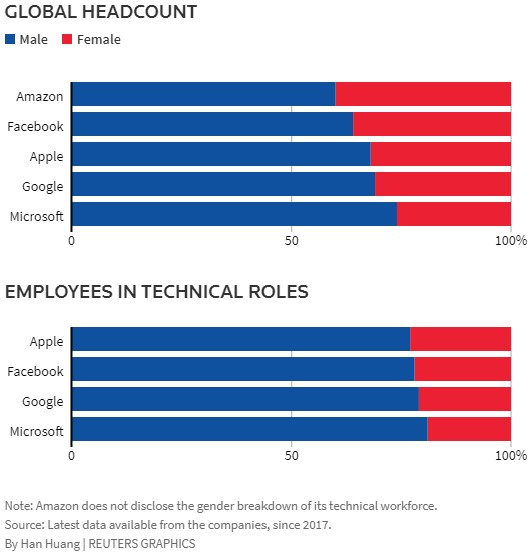
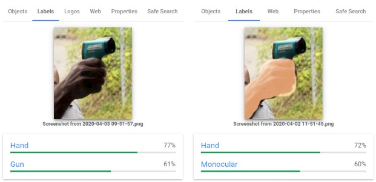
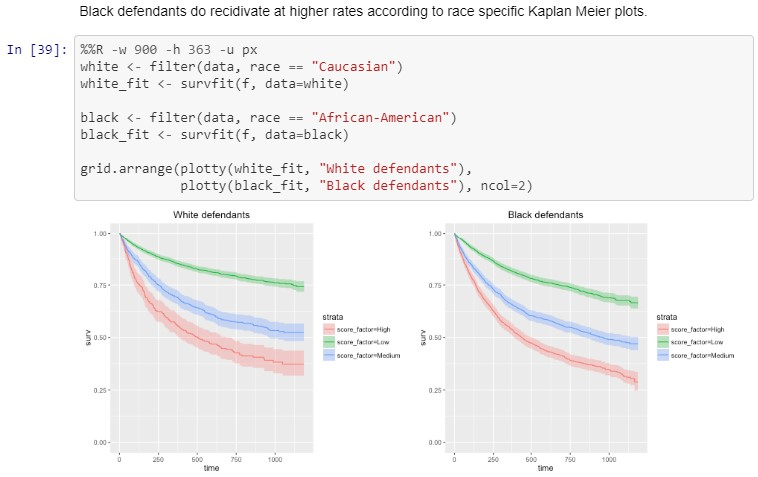
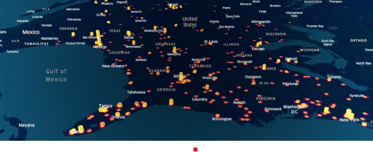
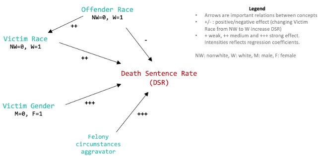

# Resources related to social bias in machine learning, artificial intelligence and data science

The below resources are divided into two groups:
1. Sources for learning about problems of algorithmic bias related to artificial intelligence, machine learning and data science (AI/ML/DS)
2. Guides/examples of how you can use AI/ML/DS to help identify and fight algorithmic bias

Much of this list is based on a presentation by Watson-in-the-Watt intern Cierra Oliveira; that presentation can be viewed [here](https://docs.google.com/presentation/d/109Tw0POt4w4itQ-Hznt7imSnHLF3t6VqPmoWun9UM-U).

## Sources describing problems of social bias

[Supposedly 'Fair' Algorithms Can Perpetuate Discrimination](https://www.wired.com/story/ideas-joi-ito-insurance-algorithms/): How the use of AI runs the risk of re-creating the insurance industry's inequities of the previous century. A look into how AI methods can wind up implementing 'redlining' techniques that disproportionately harm minority communities.

---

[Algorithmic bias detection and mitigation](https://www.brookings.edu/research/algorithmic-bias-detection-and-mitigation-best-practices-and-policies-to-reduce-consumer-harms/): Best practices and policies to reduce consumer harms. A very comprehensive article about algorithmic discrimination and techniques for avoiding it. Full of references to other useful sources.

---

[Machine Bias](https://www.propublica.org/article/machine-bias-risk-assessments-in-criminal-sentencing): ProPublica's famous investigation discovering racial bias in AI used for making decisions related to bail and criminal sentencing. 

---

[Some essential reading and research on race and technology](https://venturebeat.com/2020/06/02/some-essential-reading-and-research-on-race-and-technology/amp/?__twitter_impression=true&fbclid=IwAR1mP_5y1oJQKj851rCKSYeAGfPXSFlYQpBOZKVnbB-mLwx_k4IB3KaCwNU). This is another collection of articles, reports and books relevant to algorithmic discrimination.

---

[Amazon scraps secret AI recruiting tool that showed bias against women](https://www.reuters.com/article/us-amazon-com-jobs-automation-insight/amazon-scraps-secret-ai-recruiting-tool-that-showed-bias-against-women-idUSKCN1MK08G). A news article that illustrates how a company -- in this case Amazon -- can find itself relying on discriminatory AI.

---

[Google apologizes after its Vision AI produced racist results](https://algorithmwatch.org/en/story/google-vision-racism/). An example of the sort of algorithmic bias that can manifest in visual recognition AI: "AlgorithmWatch showed that Google Vision Cloud, a computer vision service, labeled an image of a dark-skinned individual holding a thermometer “gun” while a similar image with a light-skinned individual was labeled “electronic device”.

## Guides and examples: using AI/ML/DS to uncover bias

[An analysis of racial bias in criminal sentencing](https://investigate.ai/propublica-criminal-sentencing/). This excellent resource is a Jupyter notebook that walks through the ProPublica analysis described in the article linked above. You can follow along in Python to see how they drew their conclusions that the Compas recidivism prediction AI included racial bias, and/or adapt their code to your own purposes.

---

[How to create a 3D time-series map using Python and Kepler.gl](https://towardsdatascience.com/an-interactive-3d-map-of-police-action-s-that-have-resulted-in-death-b9d7fbf81822). This is a useful guide for working with maps; it may help you make use of data you find through the other links listed here or elsewhere. The focus of this tutorial is on producing an interactive 3D map of police interactions resulting in death.

---

[Death Sentences and Race-Ethnicity Biases](https://datajms.com/post/fairness_justice_death_sentence/#conclusion): When data shows that black lives literally mattered less. This article walks through an analysis of criminal sentencing data to support the conclusion that homicides against white victims receive harsher punishment than homicides against black victims.

---

[Racial Equity Tools](https://racialequitytools.org/home) "offers tools, research, tips, curricula and ideas for people who want t oincrease their own understanding and to help those working toward justice at every level". Of particular interest for AI/ML/DS purposes is their [data page](https://www.racialequitytools.org/fundamentals/data), which collects a wide array of data sources that you can use to begin your own analysis.

